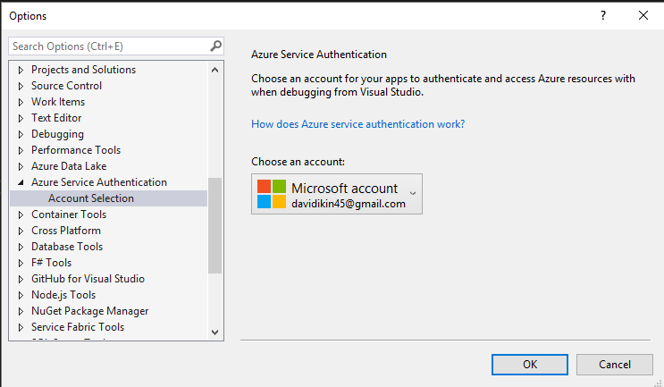
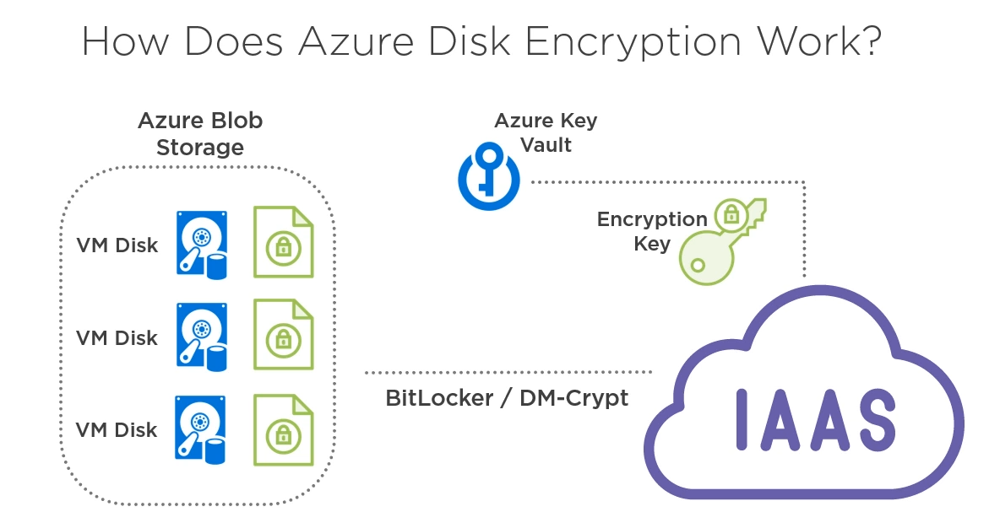
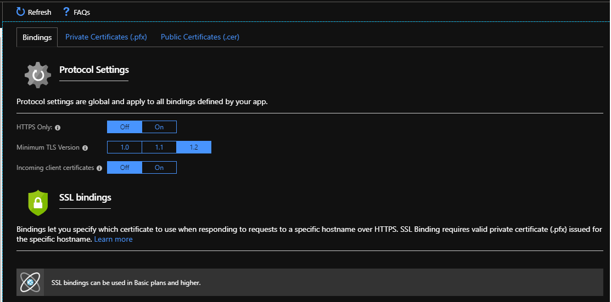
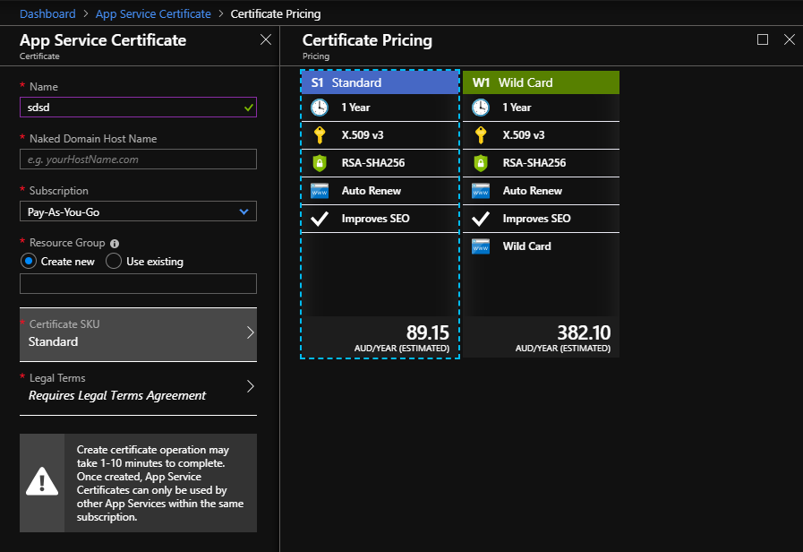
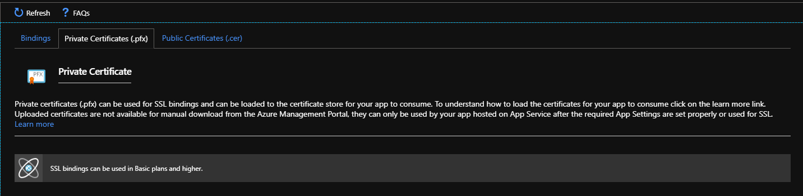

# Azure Secure Data

## Azure Key Vault
* Cryptographics keys
* Secrets. e.g Connection Strings
* Certificates 
* Vault per environment

### Useful Links
* https://joonasw.net/view/azure-ad-managed-service-identity
* https://joonasw.net/view/aspnet-core-azure-keyvault-msi

### Enable Managed Service Identity on Application
* No need to authenticate to azure key vault.
* No client id and client secret is needed in code.
* Easier to configure.
* Can authenticate to any service that support Azure AD auth.




1. App > Settings> Identity > Status> Enable
2. This will actually create a service principal in your Azure AD.
3. You can then grant this service principal access to Azure resources, like an Azure Key Vault.

### Create Key Vault
1. Create a new key vault.
2. Url will be in the following format.
```
https://{vaultName}.vault.azure.net
```

### Give Application Access to Vault
1. Azure Portal > Key Vault
2. Select Access Policies from the Key Vault resource blade
3. Click the [+ Add new] button at the top of the blade
4. Click Select Principal to select the application you created earlier
5. From the Key permissions drop down, select "Decrypt" and "Sign" to authorize the application to decrypt and sign with keys in your vault
6. From the Secret permissions drop-down, select "Get" to allow the application to read secrets in the vault

### Key Vault Soft Delete
```
Connect-AzureRmAccount
New-AzureRmKeyVault -Name "ContosoVault" -ResourceGroupName "ContosoRG" -Location "westus" -EnableSoftDelete

Connect-AzureRmAccount
($resource = Get-AzureRmResource -ResourceId (Get-AzureRmKeyVault -VaultName "digitalnomaddavekeyvault").ResourceId).Properties | Add-Member -MemberType "NoteProperty" -Name "enableSoftDelete" -Value "true"
Set-AzureRmResource -resourceid $resource.ResourceId -Properties $resource.Properties
($resource = Get-AzureRmResource -ResourceId (Get-AzureRmKeyVault -VaultName "digitalnomaddavekeyvault").ResourceId).Properties | Add-Member -MemberType "NoteProperty" -Name "enablePurgeProtection" -Value "true"
Set-AzureRmResource -resourceid $resource.ResourceId -Properties $resource.Properties
Get-AzureRmKeyVault -VaultName "digitalnomaddavekeyvault"
```

## Access SQL Server using MSI
* Transparent Data Encryption is enabled by default.
* See SQL Always Encrypted.
* https://docs.microsoft.com/en-us/azure/app-service/app-service-web-tutorial-connect-msi

## Azure Storage Security
* Data at Rest is automatically secured.
* Integegrates with Azure Key Vault.

## VM Disk Encyption
* https://docs.microsoft.com/en-us/azure/security/azure-security-disk-encryption-prerequisites
* Azure Disk Encryption (ADE) used BitBLocker/DM-Crypt under the hood.
* Another layer of security.
* Not enabled by default.
* Integegrates with Azure Key Vault.



1. Create new Windows Server 2016 VM
2. Download RDP file
3. Enable Disk Encryption on Vault
```
Set-AzureRmKeyVaultAccessPolicy -VaultName 'MySecureVault' -ResourceGroupName 'MySecureRG' -EnabledForDiskEncryption
```
4. Create a new Key
5. Enable Encryption
```
# Step 1: Create a new resource group and key vault in the same location.
    # Fill in 'MyLocation', 'MySecureRG', and 'MySecureVault' with your values.
    # Use Get-AzureRmLocation to get available locations and use the DisplayName.
    # To use an existing resource group, comment out the line for New-AzureRmResourceGroup

    $Loc = 'MyLocation';
    $rgname = 'MySecureRG';
    $KeyVaultName = 'MySecureVault'; 
    New-AzureRmResourceGroup –Name $rgname –Location $Loc;
    New-AzureRmKeyVault -VaultName $KeyVaultName -ResourceGroupName $rgname -Location $Loc;
    $KeyVault = Get-AzureRmKeyVault -VaultName $KeyVaultName -ResourceGroupName $rgname;
    $KeyVaultResourceId = (Get-AzureRmKeyVault -VaultName $KeyVaultName -ResourceGroupName $rgname).ResourceId;
    $diskEncryptionKeyVaultUrl = (Get-AzureRmKeyVault -VaultName $KeyVaultName -ResourceGroupName $rgname).VaultUri;

#Step 2: Enable the vault for disk encryption.
    Set-AzureRmKeyVaultAccessPolicy -VaultName $KeyVaultName -ResourceGroupName $rgname -EnabledForDiskEncryption;

#Step 3: Create a new key in the key vault with the Add-AzureKeyVaultKey cmdlet.
    # Fill in 'MyKeyEncryptionKey' with your value.

    $keyEncryptionKeyName = 'MyKeyEncryptionKey';
    Add-AzureKeyVaultKey -VaultName $KeyVaultName -Name $keyEncryptionKeyName -Destination 'Software';
    $keyEncryptionKeyUrl = (Get-AzureKeyVaultKey -VaultName $KeyVaultName -Name $keyEncryptionKeyName).Key.kid;

#Step 4: Encrypt the disks of an existing IaaS VM
    # Fill in 'MySecureVM' with your value. 

    $VMName = 'MySecureVM';
    Set-AzureRmVMDiskEncryptionExtension -ResourceGroupName $rgname -VMName $vmName -DiskEncryptionKeyVaultUrl $diskEncryptionKeyVaultUrl -DiskEncryptionKeyVaultId $KeyVaultResourceId -KeyEncryptionKeyUrl $keyEncryptionKeyUrl -KeyEncryptionKeyVaultId $KeyVaultResourceId;
```
6. Disable Encrpytion
```
Disable-AzureRmVMDiskEncryption -ResourceGroupName 'MySecureRG' -VMName 'MySecureVM' -VolumeType "all"
```

## SQL Always Encrypted
* Not supported in .NET Core


## SSL
* TLS 1.2 is default


1. Buy Custom Domain Name
2. Purchase App Service Certificate - Standard/Wild Card

3. Upload Certificate to Azure Key Vault
4. Create SSL bindings and enable HTTPS only
