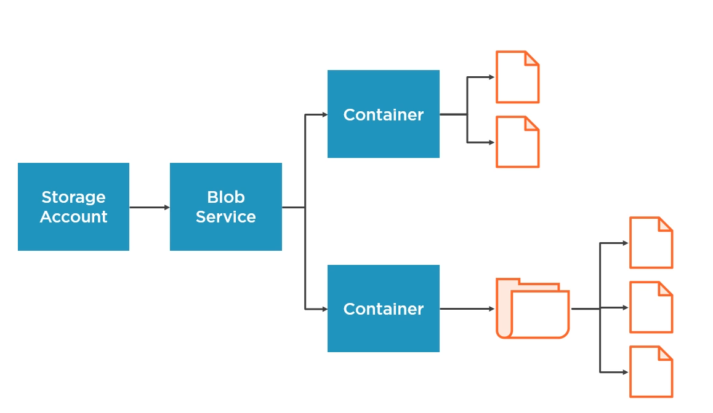
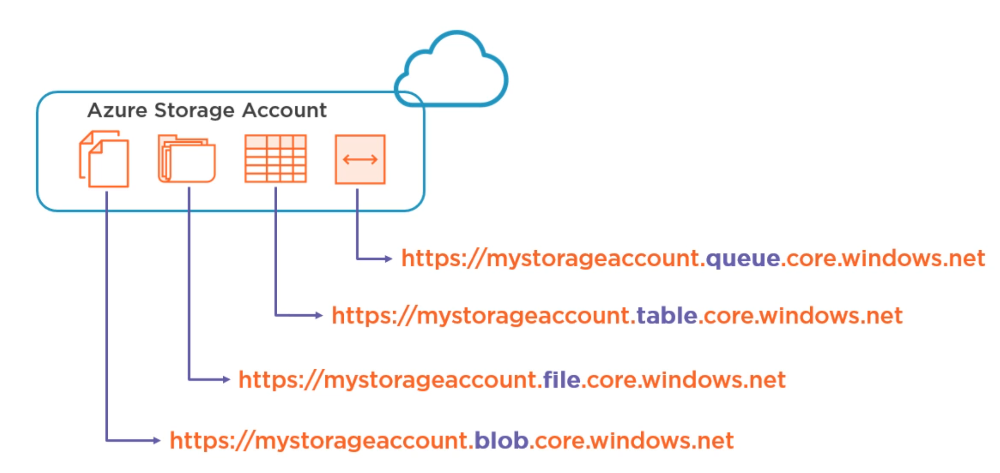
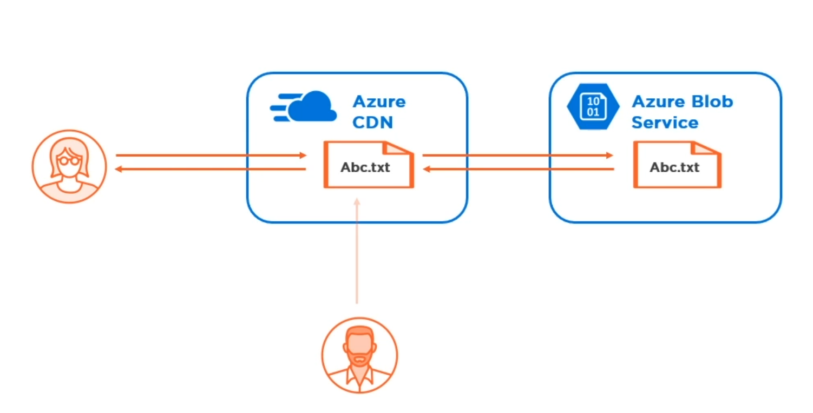

# Azure vs AWS
* [Understanding the Difference Between Microsoft Azure and Amazon AWS](https://app.pluralsight.com/library/courses/understanding-difference-microsoft-azure-amazon-aws/table-of-contents)

## Cloud Platforms
* Elasticity for short-term scaling. Can configure it so once environment hits a certain load a new environment will get spun up/down.
* Vertical(hardware)/Horizontal(instances) long-term scaling
* Pooling
* Service provisioning 

## Cloud Delivery Models
* IaaS - Infrastructure-as-a-service. e.g AWS EC2, Azure Virtual Machines. Target = Sys Admin
* PaaS - Platform-as-a-service. e.g Azure App Service. Target = Developer
* SaaS - Software-as-a-service. e.g Office 365. Target = Customer

## IaaS - Virtual Machine in the cloud
* Gives access to file system and configuration. e.g Registry

### AWS - EC2 = Elastic Compute Cloud
* [EC2 Pricing](https://aws.amazon.com/ec2/pricing/)
* Billed per hour
* Linux/Windows 
* Files stored in Azure Blob Storage
* 'On-Demand' most common

### Azure - Azure VM
* [Azure VM Pricing](https://azure.microsoft.com/en-gb/pricing/calculator/?service=virtual-machines)
* Billed per minute
* Linux/Windows
* Files stored in EBS (Elastic Block Storage)


## PaaS - Application Hosting

### AWS - Elastic Beanstalk
* [AWS Free Tier](https://aws.amazon.com/free/) - Elastic Beanstalk
* https://aws.amazon.com/visualstudio/


### Azure - Azure App Service
* https://azure.microsoft.com/en-gb/tools/
* [Azure Pricing](https://azure.microsoft.com/en-gb/pricing/details/app-service/windows/) - Azure App Service


## Storage

### Azure
* [Microsoft Azure Developer: Implementing File Storage](https://app.pluralsight.com/library/courses/microsoft-azure-file-storage-implementing/table-of-contents)
* [Microsoft Azure Developer: Implementing Blob Storage](https://app.pluralsight.com/library/courses/microsoft-azure-blob-storage-implementing/table-of-contents)
* [Refactoring an App to Microsoft Azure Apps](https://app.pluralsight.com/library/courses/microsoft-azure-app-refactoring/table-of-contents)

1. On Azure create a GPv2 Storage Account (Blob, Disk/File, Table Storage + Cosmos (NoSql), Queue) 
2. Public Access Levels: Private(No Anonymous Access), Blob (Anonymous Read for BLOB), Container (Anonymous Read for Container and BLOB)
3. WORM Policies: legal hold, time-based retention.
4. Blob Service > Soft delete
5. Blob Service > Static website. Creates a $web container
6. Blob Service > Azure CDN (Caching)
7. Calculate cost https://azure.microsoft.com/en-us/pricing/calculator/
8. Start Windows Azure Storage Emulator
9. To use the development azure storage use the following connection string
```
"UseDevelopmentStorage=true";
```
10. Create "Shared Access Signature" so someone can access resource for a certain period.





### Azure Storage Tools
* [Data Migration Assistant](https://www.microsoft.com/en-us/download/confirmation.aspx?id=53595)
* [Microsoft Azure Table Storage Explorer](https://azure.microsoft.com/en-us/features/storage-explorer/)
* [AzCopy](https://docs.microsoft.com/en-us/azure/storage/common/storage-use-azcopy)
* [CloudBerry Explorer](https://www.cloudberrylab.com/download.aspx?prod=cbazure)

### Azure CLI
* [Azure CLI](https://docs.microsoft.com/en-us/cli/azure/install-azure-cli-windows?view=azure-cli-latest)

Create Resource Group and Storage Account
```
az storage --help
az login
az group create --name testResourceGroup --location "East US"
az storage account create --location "East US" --kind StorageV@ --name storageAccountName --resource-group testResourceGroup --sku Standard_LRS
```

Connection String
```
az storage account show-connection-string --name storageAccountName --resource-group testResourceGroup
SET AZURE_STORAGE_CONNECTION_STRING="..."
```

Create Private Container
```
az storage container create --name container
```

Create Public Container
```
az storage container create --name container1 --public-access blob
```

Create Public Container 2
```
az storage container create --name container2 --public-access container
```

Set Container Access Level
```
az storage container set-permission --name container1 --public-access container
```

Delete Policy
```
az storage blob service-properties delete-policy show --acount-name storageAccountName
```

Delete Policy Enable
```
az storage blob service-properties delete-policy update --enable true --days-retained 7 --acount-name storageAccountName
```

### AzCopy
* Add C:\Program Files (x86)\Microsoft SDKs\Azure\AzCopy to the User and System path
``` 
AzCopy /?
```

Copy Files to Container
``` 
AzCopy /Source:C\Upload /Dest:https://storageaccountname.blob.core.windows.net/newcontainername /DestKey:... /Pattern:"*.txt" /S /Y
```

Copy Files to Container with Logging
``` 
AzCopy /Source:C\Upload /Dest:https://storageaccountname.blob.core.windows.net/newcontainername /DestKey:... /Pattern:"*.txt" /S /Y /V:C:\Logs\azopy.log
```

Copy Updated  Files to Container
``` 
AzCopy /Source:C\Upload /Dest:https://storageaccountname.blob.core.windows.net/newcontainername /DestKey:... /Pattern:"*.txt" /S /Y /XO

AzCopy /Source:C\Upload /Dest:https://storageaccountname.blob.core.windows.net/newcontainername /DestSAS:... /Pattern:"*.txt" /S /Y /XO
```

### CDN = Content Delivery Network
* Offload traffic from blob origin server to CDN edge servers
* Typically static data
* Default endpoint https://endpoint.azureedge.net



### Azure Search
*  Create an Azure Search service to index BLOBs
* Can add cognitive services to do image OCR

### AWS
* [S3 = Blob Storage](https://aws.amazon.com/s3/pricing/)
* EBS = Block Storage for VM's

### AWS Storage Tools
* [S3 Browser](http://s3browser.com/)
* [CloudBerry Explorer](https://www.cloudberrylab.com/download.aspx?prod=cbes3free)
* [AWS Powershell Tools](https://aws.amazon.com/powershell/)

## Relational Databases

### Azure
* Azure SQL Database

### AWS 
* [AWS RDS](https://us-east-2.console.aws.amazon.com/rds/home)

## NoSQL Databases

### Azure
* [Table Storage](https://azure.microsoft.com/en-gb/services/storage/tables/)
* [Cosmos](https://docs.microsoft.com/en-us/azure/cosmos-db/introduction)
* [Cosmos Playground](https://www.documentdb.com/sql/demo)

### AWS 
* [SimpleDB](https://aws.amazon.com/simpledb/)
* [DynamoDB](https://aws.amazon.com/dynamodb/)

## In-memory Caching

### Azure
* [Redis](https://azure.microsoft.com/en-gb/services/cache/)

### AWS
* [ElastiCache](https://aws.amazon.com/elasticache/)

## Data Warehouse (Big Data)


### Azure


## Security
* Key vaults allow you to manage credentials and programatically get the credentials without exposing plain text password.

### Azure
* [Key Vault](https://azure.microsoft.com/en-gb/pricing/details/key-vault/)
* [Multi-Factor Authentication](https://azure.microsoft.com/en-gb/pricing/details/multi-factor-authentication/)

### AWS
* [Key Management Services](https://aws.amazon.com/kms/)
* [Multi-Factor Authentication](https://aws.amazon.com/iam/details/mfa/)

## SLA's

### Azure
* https://azure.microsoft.com/en-gb/support/legal/sla/

### AWS
* https://aws.amazon.com/de/legal/service-level-agreements/

## Budget Alerts

### Azure
* https://portal.azure.com/#blade/Microsoft_Azure_Billing/SubscriptionsBlade

### AWS
* https://console.aws.amazon.com/billing/home?#/budgets
* https://us-east-2.console.aws.amazon.com/cloudwatch/home
